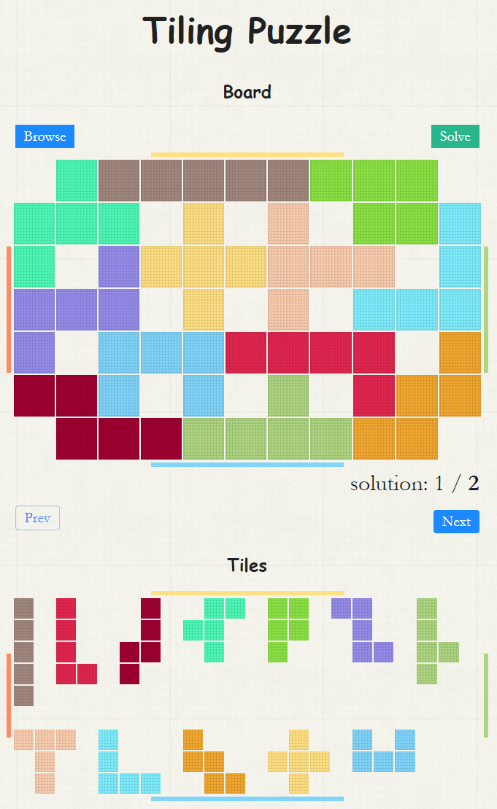

# Tiling Puzzle Solver
This is a 2D polyomino tiling puzzle solver implemented in JavaScipt based on Dancing Links algorithm.

Demo page: [Tiling Puzzle](https://www.crabfishhh.com/tilingpuzzle)

## How to play

Just click `Browse` button and upload the file described as below. Then click `Solve` to show all the solutions(Some cases may cost long time to solve). 

## Screenshot



## Input Format
The puzzle is encoded in a single ASCII input file by using various characters to denote the shapes and colors of the tiles; tiles may be arbitrarily oriented placed in the input file, and the target configuration is assumed to be the largest tile in that file.

Example 1: thirteen_holes.txt
```

       O  O        O
   OO  O  O   OO   O  OO        
  OO   O  O   OO  OO   O        
   O   O  OO  O   O    OO       
       O                    O   
  OOO        O    O     O   O   
   O   O O   O    OO   OOO  OO  
   O   OOO   OOO   OO   O   O   

 OOOOOOOOO
OOO O O OOO
O OOOOOOO O
OOO O O OOO
O OOOOOOO O
OOO O O OOO
 OOOOOOOOO

```

Example 2: checkerboard.txt
```

         O     OXOXO         OX          
     X   XO        X  XO     XO          XOXOXOXO
     O    XO           X     O     X     OXOXOXOX
     X                       X     O     XOXOXOXO
           X   O     XO         OXOX     OXOXOXOX
    XOXO   O   X     OX                  XOXOXOXO
    O      X   OXO    O    X             OXOXOXOX
    X      O          X    O    OX       XOXOXOXO
           XO         O    X    XO       OXOXOXOX
                          XO     X       
                          O  

```

You can find more in `testcases` dir.